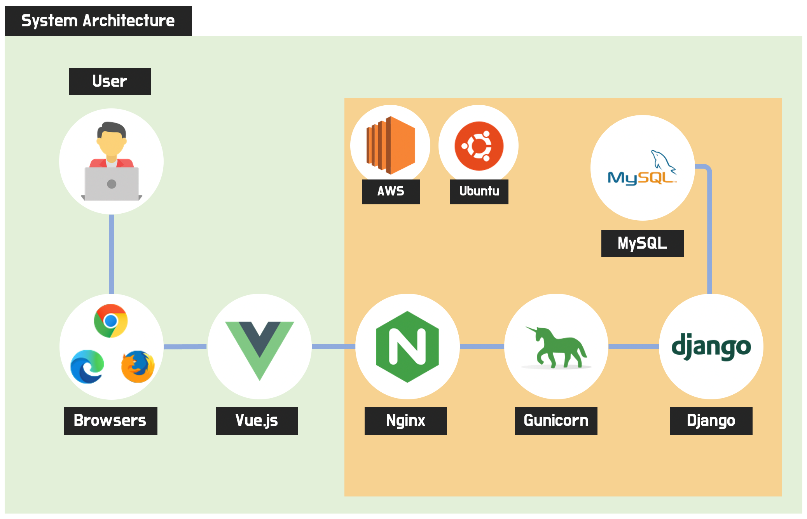
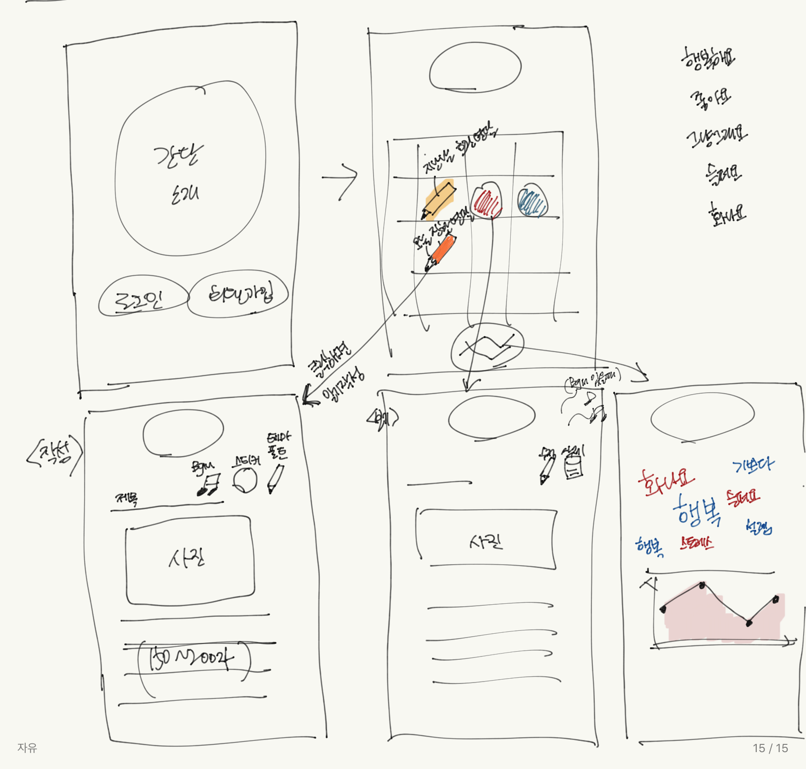

# **프로젝트 계획서**

> **1. 프로젝트 개요**

1. 프로젝트 주제
- 나만의 일기를 작성할 수 있는 공간을 제공하고, 그 내용을 바탕으로 그날의 감정을 분석해서 하루를 마무리할 수 있는 음악을 추천받을 수 있도록 서비스
2. 주제 선정 배경 및 시장 분석
   - 기술/ 트렌드 동향
   
     - 재택 학습 및 재택 근무의 증가와 함께 우리의 일상은 실외에서 실내로, 단체 생활에서 개인 생활로 급변했다. 이에 따라 다이어리 꾸미기, 세 줄 일기 등 개인 일상을 기록하는데 관심을 가지고 있다. 
   
       하지만 기존 서비스들은 텍스트와 사진에 한정되어 있을뿐더러 bgm을 첨부하지 못하고, 그날의 감정을 직접 입력해야 한다는 한계가 있다. 이런 기존 서비스들은 일상 기록 남기기에는 충분하지만 평소 일기를 작성하는 사람들의 니즈를 충족시키기에는 기능이 부족하다.
   
   - 국내 현황
     - 스트롱벤처스가 투자한 윌림의 “세줄일기”, 감정을 담아내는 일기로 “emolog”, “HelloMood” 등의 여러 어플리케이션의 핵심은 짧은 내용을 담아내고, 기분을 기록하는  일기 서비스이다. 특히 국내의 서비스 동향은 간단하게 작성하는 일기에 집중되어있다. 하지만 이러한 서비스로는 그날 하루, 사용자에 따라서는 기분을 풀어내는 공간으로 부족함을 느낄 수 있다. 또한 솔직한 감정을 담아내다보면 어떠한 감정이 더 큰지 혼란스러울 경우도 있다.
   
   - 유사 서비스 사례 소개
     - “세줄일기”, “데일리노트” 등의 어플리케이션은 텍스트에 집중된 일기 서비스를 제공하고 있고, “emolog”, “mooda”, “HelloMood”, “모지또”는 귀여운 느낌의 이모지를 제공하는 서비스를 제공하고 있다. 이러한 일기 서비스는 적은 양의 내용들만을 한정적으로 하여 기분을 나타내고 있고 일부 회사에서 제공하는 서비스만 통계적으로 기분 등을 나타내어 관리해주고 있다.
   
   - 소비자/시장에 줄 수 있는 가치
   
   - 향후 전망
3. 목표

> **2.분석 및 설계**

1. 요구사항 정의
    | ID | 요구사항명 | 설명 |
    |----|------------|------|
    | Req. 1. |	로그인/로그아웃 | 소셜로그인으로 기능을 구현한다. |
    | Req. 2. |	일기 관리 |	캘린더로 일기 작성 및 감정 표현 |
    | Req. 3. |	일기 작성 |	150-200자 내외로 일기 작성. 사진 및 BGM 추가 가능 스타일(테마, 폰트 등) 변경 가능 |
    | Req. 4. |	일기 수정/삭제 | 작성된 일기 수정/삭제 가능 |
    | Req. 5. |	음악 추천 | 작성된 일기를 분석하여 그날의 감정에 맞는 음악 추천 |
    | Req. 6. |	워드클라우드 | 작성된 일기를 기반으로 주별, 월별 및 감정별 워드클라우드 제공 |
    | Req. 7. |	감정 그래프 | 주별, 월별 일기를 기반으로 감정 패턴 분석 및 시각화 |

2. 개발 언어 및 활용 기술

3. 예산

   | 항목              | 상세(사유)                                                   | 수량 | 비용       |
   | ----------------- | ------------------------------------------------------------ | ---- | ---------- |
   | AWS 프로젝트 서버 | ※ 미신청 시 제공되지 않음. 1대 초과 신청 시에는 각 서버에 대한 목적 필수 기입 | 1    |            |
   | 이러닝-인프런     | 파이썬 머신러닝 완벽 가이드  https://www.inflearn.com/course/파이썬-머신러닝-완벽가이드 | 1    | 99000      |
   | 도서              | 파이썬 머신러닝 완벽 가이드  http://www.yes24.com/Product/Goods/69752484 | 1    | 38000      |
   | 이러닝-인프런     | 초보를 위한 도커 안내서  [https://www.inflearn.com/course/%EB%8F%84%EC%BB%A4-%EC%9E%85%EB%AC%B8](https://www.inflearn.com/course/도커-입문) | 1    | 29700      |
   | 이러닝-인프런     | SVG 마스터  https://www.inflearn.com/course/mastering-svg    | 1    | 27500      |
   | 이러닝-인프런     | 함수형 프로그래밍과 JavaScript ES6+  https://www.inflearn.com/course/functional-es6 | 1    | 55000      |
   | **합계**          |                                                              |      | **249200** |

   

> **3. 개발 계획**

1. 팀원별 담당 역할

2. 일정 계획

   | **시작일** | **종료일** | **내용**                    |
   | ---------- | ---------- | --------------------------- |
   | 20.10.15   | 20.10.16   | 기능 목록 상세 도출         |
   | 20.10.15   | 20.10.16   | 화면 기획(화면 정의서 작성) |
   | 20.10.19   | 20.10.20   | 개발 환경 구성              |
   | 20.10.20   | 20.11.11   | 개발: 백엔드 / DB 스키마    |
   | 20.10.20   | 20.11.11   | 개발: 사용자 화면 개발      |
   | 20.11.11   | 20.11.13   | 완성 기능 리뷰              |
   | 20.11.16   | 20.11.18   | 개선 사항 추가 개발         |
   | 20.11.16   | 20.11.18   | 통합 테스트                 |
   | 20.11.18   | 20.11.20   | 발표자료 준비               |
   | 20.11.23   | 20.11.23   | 사이트 런칭                 |
   | 20.10.15   | 20.10.16   | 기능 목록 상세 도출         |

3. 애플리케이션 아키텍쳐

