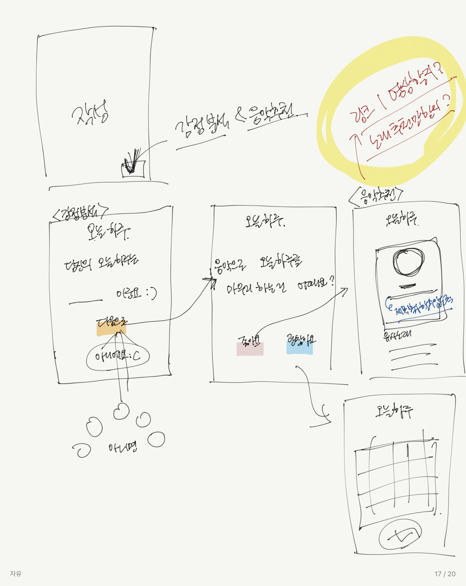
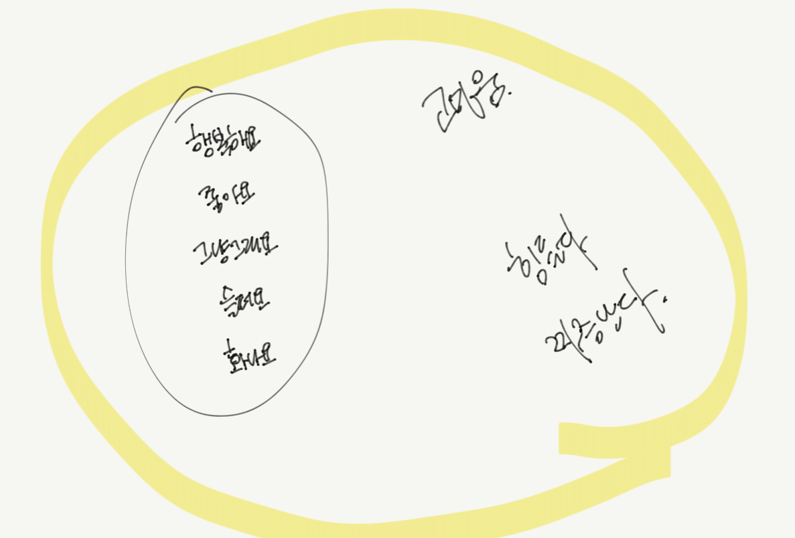

# **프로젝트 계획서**

> **1. 프로젝트 개요**

1. 프로젝트 주제
2. 주제 선정 배경 및 시장 분석
   - 기술/ 트렌드 동향
   
     - 재택 학습 및 재택 근무의 증가와 함께 우리의 일상은 실외에서 실내로, 단체 생활에서 개인 생활로 급변했다. 이에 따라 다이어리 꾸미기, 세 줄 일기 등 개인 일상을 기록하는데 관심을 가지고 있다. 
   
       하지만 기존 서비스들은 텍스트와 사진에 한정되어 있을뿐더러 bgm을 첨부하지 못하고, 그날의 감정을 직접 입력해야 한다는 한계가 있다. 이런 기존 서비스들은 일상 기록 남기기에는 충분하지만 평소 일기를 작성하는 사람들의 니즈를 충족시키기에는 기능이 부족하다.
   
   - 국내 현황
   
   - 유사 서비스 사례 소개
   
   - 소비자/시장에 줄 수 있는 가치
   
   - 향후 전망
3. 목표

> **2.분석 및 설계**

1. 요구사항 정의

2. 개발 언어 및 활용 기술

3. 예산

   | 항목              | 상세(사유)                                                   | 수량 | 비용       |
   | ----------------- | ------------------------------------------------------------ | ---- | ---------- |
   | AWS 프로젝트 서버 | ※ 미신청 시 제공되지 않음. 1대 초과 신청 시에는 각 서버에 대한 목적 필수 기입 | 1    |            |
   | 이러닝-인프런     | 파이썬 머신러닝 완벽 가이드  https://www.inflearn.com/course/파이썬-머신러닝-완벽가이드 | 1    | 99000      |
   | 도서              | 파이썬 머신러닝 완벽 가이드  http://www.yes24.com/Product/Goods/69752484 | 1    | 38000      |
   | 이러닝-인프런     | 초보를 위한 도커 안내서  [https://www.inflearn.com/course/%EB%8F%84%EC%BB%A4-%EC%9E%85%EB%AC%B8](https://www.inflearn.com/course/도커-입문) | 1    | 29700      |
   | 이러닝-인프런     | SVG 마스터  https://www.inflearn.com/course/mastering-svg    | 1    | 27500      |
   | 이러닝-인프런     | 함수형 프로그래밍과 JavaScript ES6+  https://www.inflearn.com/course/functional-es6 | 1    | 55000      |
   | **합계**          |                                                              |      | **249200** |

   

> **3. 개발 계획**

1. 팀원별 담당 역할

2. 일정 계획

   | **시작일** | **종료일** | **내용**                    |
   | ---------- | ---------- | --------------------------- |
   | 20.10.15   | 20.10.16   | 기능 목록 상세 도출         |
   | 20.10.15   | 20.10.16   | 화면 기획(화면 정의서 작성) |
   | 20.10.19   | 20.10.20   | 개발 환경 구성              |
   | 20.10.20   | 20.11.11   | 개발: 백엔드 / DB 스키마    |
   | 20.10.20   | 20.11.11   | 개발: 사용자 화면 개발      |
   | 20.11.11   | 20.11.13   | 완성 기능 리뷰              |
   | 20.11.16   | 20.11.18   | 개선 사항 추가 개발         |
   | 20.11.16   | 20.11.18   | 통합 테스트                 |
   | 20.11.18   | 20.11.20   | 발표자료 준비               |
   | 20.11.23   | 20.11.23   | 사이트 런칭                 |
   | 20.10.15   | 20.10.16   | 기능 목록 상세 도출         |

3. 애플리케이션 아키텍쳐

